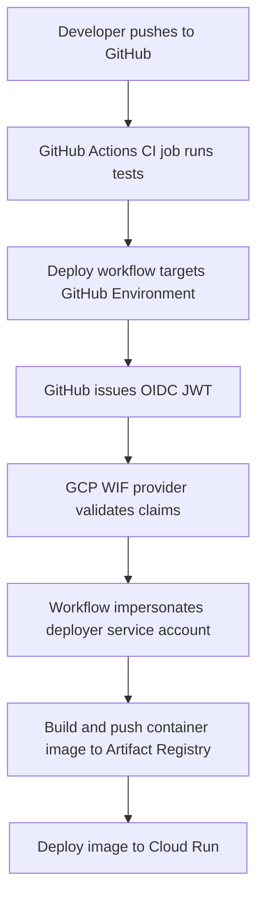

# OIDC / GitHub Actions / GCP WIF Teaching Lab

This repository teaches how GitHub Actions can deploy to Google Cloud without long-lived service account keys, while still keeping trust boundaries narrow enough to reason about.

Mental model:

```text
GitHub Actions job
  → receives OIDC JWT from GitHub
  → GCP WIF validates claims
  → job impersonates deployer service account
  → deployer service account pushes image and deploys Cloud Run
```

## What this lab teaches

- OIDC basics in CI/CD
- the difference between authentication and authorization
- GitHub Actions permissions and why `id-token: write` is not the same thing as cloud admin
- Google Cloud Workload Identity Federation
- service account impersonation
- IAM blast radius review
- why staging and production should not share the same trust boundary

## Architecture



More diagrams live in [docs/diagrams/trust-flow.mmd](/Users/waddymontero/Documents/OIDC%20WIF%20Lab/docs/diagrams/trust-flow.mmd), [docs/diagrams/iam-relationships.mmd](/Users/waddymontero/Documents/OIDC%20WIF%20Lab/docs/diagrams/iam-relationships.mmd), and [docs/diagrams/ci-cd-sequence.mmd](/Users/waddymontero/Documents/OIDC%20WIF%20Lab/docs/diagrams/ci-cd-sequence.mmd).

## Prerequisites

- `gcloud`
- `terraform`
- `gh`
- Docker
- a GCP project with billing enabled
- a GitHub repository with `staging` and `production` environments

## Setup

1. Log into GitHub CLI and Google Cloud:
   ```bash
   gh auth login
   gcloud auth login
   gcloud auth application-default login
   ```
2. Copy [infra/terraform.tfvars.example](/Users/waddymontero/Documents/OIDC%20WIF%20Lab/infra/terraform.tfvars.example) to `infra/terraform.tfvars` and fill in the real project and repo values.
3. Review the infrastructure notes in [infra/README.md](/Users/waddymontero/Documents/OIDC%20WIF%20Lab/infra/README.md).
4. Initialize and apply Terraform:
   ```bash
   make terraform-fmt
   make terraform-validate
   make apply
   ```
5. Configure GitHub Environment variables from Terraform outputs:
   ```bash
   ./scripts/configure-github-vars.sh
   ```

## Deploy flow

- Push to `main` to trigger staging deployment.
- Use the `Deploy Production` workflow manually for production.
- Use `OIDC Claims Debug` to inspect the token payload safely.

## Cleanup

```bash
make destroy
```

Also review [docs/runbooks/cleanup.md](/Users/waddymontero/Documents/OIDC%20WIF%20Lab/docs/runbooks/cleanup.md).

## Warnings

Cost warning:
Cloud Run and Artifact Registry are low-cost for a lab, but they are not free in every usage pattern. Clean up when done.

Security warning:
This repository demonstrates secure patterns and intentionally insecure examples side by side. Do not copy the insecure examples into a real environment.

Action pinning note:
The workflows use stable major action tags for readability in a teaching repo. In production, prefer pinning third-party actions to full commit SHAs and reviewing updates deliberately.

## Learning path

- Workshops: [docs/workshops/01-oidc-and-github-actions.md](/Users/waddymontero/Documents/OIDC%20WIF%20Lab/docs/workshops/01-oidc-and-github-actions.md), [docs/workshops/02-gcp-wif-and-service-account-impersonation.md](/Users/waddymontero/Documents/OIDC%20WIF%20Lab/docs/workshops/02-gcp-wif-and-service-account-impersonation.md), [docs/workshops/03-iam-blast-radius-review.md](/Users/waddymontero/Documents/OIDC%20WIF%20Lab/docs/workshops/03-iam-blast-radius-review.md), [docs/workshops/04-break-fix-exercises.md](/Users/waddymontero/Documents/OIDC%20WIF%20Lab/docs/workshops/04-break-fix-exercises.md)
- Quizzes: [docs/quizzes/quiz-01-oidc.md](/Users/waddymontero/Documents/OIDC%20WIF%20Lab/docs/quizzes/quiz-01-oidc.md), [docs/quizzes/quiz-02-wif.md](/Users/waddymontero/Documents/OIDC%20WIF%20Lab/docs/quizzes/quiz-02-wif.md), [docs/quizzes/quiz-03-iam.md](/Users/waddymontero/Documents/OIDC%20WIF%20Lab/docs/quizzes/quiz-03-iam.md), [docs/quizzes/answer-key.md](/Users/waddymontero/Documents/OIDC%20WIF%20Lab/docs/quizzes/answer-key.md)
- Runbooks: [docs/runbooks/initial-setup.md](/Users/waddymontero/Documents/OIDC%20WIF%20Lab/docs/runbooks/initial-setup.md), [docs/runbooks/deploy.md](/Users/waddymontero/Documents/OIDC%20WIF%20Lab/docs/runbooks/deploy.md), [docs/runbooks/troubleshoot-wif.md](/Users/waddymontero/Documents/OIDC%20WIF%20Lab/docs/runbooks/troubleshoot-wif.md)
- Secure reference and exercises: [labs/secure-reference/README.md](/Users/waddymontero/Documents/OIDC%20WIF%20Lab/labs/secure-reference/README.md), [labs/exercises/exercise-01-decode-oidc-claims.md](/Users/waddymontero/Documents/OIDC%20WIF%20Lab/labs/exercises/exercise-01-decode-oidc-claims.md)
